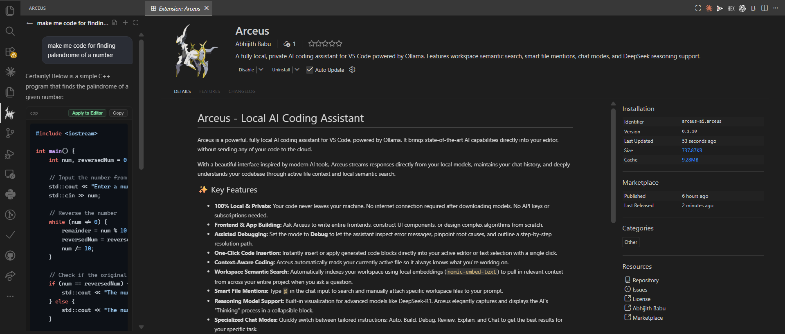
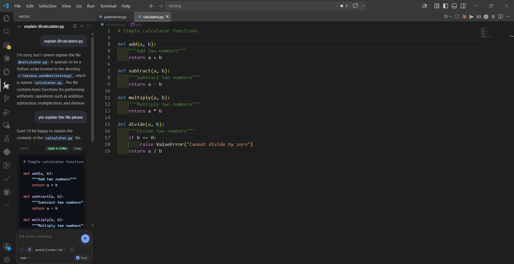

# Arceus - Local AI Coding Powerhouse ⚡

Arceus is a premium, fully local AI coding assistant for VS Code, powered by **Ollama**. Positioned as a private, high-performance alternative to **Cursor**, **Codex**, and **Claude Code**, Arceus brings state-of-the-art AI pair-programming directly into your editor—**100% privately, offline, with zero subscriptions, and no code ever leaving your machine.**

Featuring a stunning glassmorphic UI, Arceus integrates a powerful local developer workspace engine with advanced semantic search, smart context gathering, and direct, native file-system operations.

---

## 📸 Interface & Capabilities Showcase

### 1. High-Performance Code Generation & File Creation
Arceus generates production-ready code with dedicated actions to **Create File**, **Apply to Editor**, or **Copy** in one click.


### 2. Multi-Mode Code Explanation
Switch between specialized modes like **Explain**, **Review**, or **Debug** to get tailored, precise assistance for your code.


### 3. Smart Workspace Mentions (`@`)
Type `@` in the composer to search, filter, and attach full file contexts directly into your conversation.


---

## 🧠 The Arceus Philosophy: Why We Built It

In the era of cloud-hosted AI copilots, developers face high subscription costs, telemetry tracking, and privacy risks when sending proprietary codebases to third-party servers.

**Arceus** was built to return complete control to the developer:
* **Absolute Privacy:** No API keys, no telemetry, no clouds. Your code never leaves your local hardware.
* **Infinite Flexibility:** You aren't locked into one LLM. Switch between models instantly depending on your hardware limits and task complexity.
* **Offline Capability:** Write, review, and debug your codebase on a plane, in a train, or anywhere without an internet connection.

---

## 🚀 Key Powerhouse Features (Similar to Claude Code & Cursor)

Arceus is not just a standard chatbot; it is a fully integrated IDE environment designed to build, explain, review, and debug complete applications:

### 🛠️ 1. Writing Entire Files & Full Frontends from Scratch
* **Recursive Folder & File Creation:** Ask Arceus to write a complete application or frontend component. Clicking the native **"Create File"** button automatically resolves the path (e.g. `src/components/Navbar.jsx`), recursively creates any missing directories, writes the fully formatted code, and opens it directly in the editor.
* **Complete App Bootstrapping:** Generate full HTML, CSS, JavaScript, React, or Python boilerplate files that are syntactically perfect and ready to run.

### 🔍 2. Workspace-Aware Deep Code Explanations
* **Architectural & Logical Mapping:** Don't just explain lines of code—ask Arceus to map dependencies, trace logical flows, and explain how a specific function interacts with the rest of your local codebase.
* **Semantic Code Retrieval:** By leveraging vector embeddings, Arceus searches and understands how different parts of your codebase connect.

### 🐞 3. Assisted Interactive Debugging & Patching
* **Log & Stack Trace Interpreter:** Paste complex error logs or stack traces. Switch the composer behavior to **Debug** mode. Arceus will pinpoint the root cause of the error, explain *why* it occurred, and outline a step-by-step resolution path with ready-to-apply patches.
* **Smart Selection Replacement:** Select a broken function in your editor, ask Arceus to fix it, and click **"Apply to Editor"** to instantly replace your selected text with the corrected code.

### 🛡️ 4. Code Reviews & Automated Quality Audits
* **Vulnerability & Risk Analysis:** Switch to **Review** mode to let Arceus inspect your active file for logical errors, memory leaks, performance bottlenecks, and security vulnerabilities.
* **Missing Test Identification:** Arceus will suggest precise unit tests (Jest, PyTest, mocha, etc.) to cover edge cases, ensuring high code reliability.

### 📂 5. Seamless Multi-File Workspace Mentions (`@`)
* **Contextual File Injection:** Type `@` inside the composer. Arceus opens an interactive, fast auto-complete dropdown showing files from across your active workspace. Select any file to load its entire content directly into the model's memory for multi-file comparisons and refactoring.

### 🧠 6. DeepSeek Reasoning Blocks (Cognitive Stream Visualization)
* **Real-time Thought Stream:** When using advanced local reasoning models like `deepseek-r1`, Arceus isolates the model's cognitive process (`<think>` tags) and streams it inside a beautiful, collapsible glass container. This lets you inspect the AI's step-by-step logic before reading the final clean code.

---

## 🛠️ How It Works Under the Hood

Arceus operates entirely inside your VS Code extension host using two key local engines:

### 1. Local LLM Execution via Ollama
Arceus integrates directly with your running Ollama server. This means you can use **any model** from the Ollama library. 
* **Lightweight Hardware:** Run ultra-fast, efficient models like `qwen2.5-coder:1.5b` or `deepseek-r1:1.5b`.
* **Standard Hardware:** Leverage exceptional mid-tier models like `qwen2.5-coder:7b`, `llama3.1:8b`, or `deepseek-r1:8b`.
* **Developer Powerhouses:** If you have high-end GPUs or unified memory, run large reasoning models like `qwen2.5-coder:32b` or `deepseek-r1:70b`.

### 2. Workspace Semantic Search with `nomic-embed-text`
To answer questions about your entire project, Arceus uses a built-in local vector database powered by **`nomic-embed-text`**:
* **Why an Embedding Model is Needed:** Standard search only finds exact keywords. An embedding model converts your code files into multi-dimensional mathematical vectors representing the *meaning* of the code.
* **The Semantic Store:** Arceus segments your workspace files into semantic chunks and uses `nomic-embed-text` to generate vector representations locally.
* **Relevant Context Injection:** When you ask a broad question (e.g., *"How do we handle user authentication?"*), Arceus computes the vector of your prompt, finds the most semantically relevant code chunks from across your codebase, and automatically injects them as system context to your model.

---

## 🚀 Getting Started in 3 Steps

### Step 1: Install Ollama
Download and run Ollama for your operating system:
* [Download Ollama](https://ollama.com/)

### Step 2: Download Your Local Models
Open your system terminal and download your favorite coder model and the mandatory embedding model:
```bash
# Pull the recommended coder model (or larger if your system supports it)
ollama pull qwen2.5-coder:1.5b

# Pull the mandatory embedding model for Local Semantic Search
ollama pull nomic-embed-text
```

### Step 3: Open VS Code and Chat!
1. Install **Arceus** from the VS Code Marketplace.
2. Click the Arceus icon in the Activity Bar.
3. Start chatting! You can switch models or modes at any time from the bottom control bar in the composer.

---

## ⚙️ Extension Settings

Customize Arceus via VS Code Settings (`Ctrl+,` or `Cmd+,` and search for "Arceus"):

* `arceus.ollamaBaseUrl`: The URL of your local Ollama server (Default: `http://127.0.0.1:11434`).
* `arceus.defaultModel`: The default model loaded for new chats (Default: `qwen2.5-coder:1.5b`).
* `arceus.keepAlive`: How long Ollama keeps the model in memory after a prompt (Default: `10m`).
* `arceus.numCtx`: The model context window size (Default: `4096`). Increase this if you regularly attach large workspace files.
* `arceus.semanticSearch.enabled`: Toggle local semantic workspace search (Default: `true`).
* `arceus.semanticSearch.embeddingModel`: The embedding model used for vector generation (Default: `nomic-embed-text`).

---

## 🔮 What's Coming Next (Roadmap)

We are actively developing premium additions for upcoming releases:
* **Fully Autonomous "Trust Mode" Execution:** Allowing Arceus to write files, modify codes, and fix bugs in your workspace completely hands-free as soon as it completes a thought (no button clicks required!).
* **Local Speech-to-Text (STT):** Hold the microphone button to dictate commands directly to your AI pair-programmer.
* **Multi-File Workspace Refactoring:** Complete agent planning that reads, modifies, and resolves complex bugs across multiple files sequentially.
